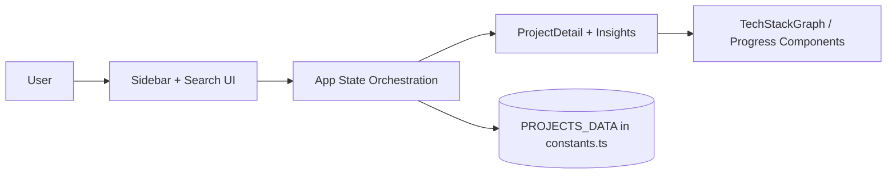
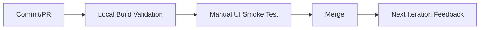

# Portfolio Projects Wiki

> **Status key:** 🟢 Done · 🟠 In Progress · 🔵 Planned · 🔄 Recovery/Rebuild · 📝 Documentation Pending

## 🎯 Overview
Portfolio Projects Wiki is a single-page React application that turns portfolio entries into structured, review-ready technical documentation instead of static résumé bullets. It is intended for developers curating project history, recruiters screening technical depth, and engineering reviewers validating implementation quality. The app organizes project records by maturity, supports fuzzy search, and presents architecture and stack context in a unified detail view. Success means users can quickly find a project, understand its technical scope, and assess delivery quality without opening multiple disconnected docs. The current implementation focuses on a fast local workflow powered by TypeScript data models and reusable UI components. It prioritizes clarity, consistency, and transparent progress tracking over backend complexity.

### Outcomes
- Reduce time-to-understanding for each showcased project through standardized project detail sections.
- Improve stakeholder trust by exposing project status, technical context, and implementation notes in one place.
- Maintain a repeatable documentation format that can scale as additional portfolio projects are added.
- Provide a stable local-first review environment with predictable build and preview workflows.

---
## 📌 Scope & Status

| Area | Status | Notes | Next Milestone |
|---|---|---|---|
| Core browsing workflow (sidebar, search, detail rendering) | 🟢 Done | End-to-end local flow is implemented in React with in-memory project data. | Add route-based deep linking for project slugs. |
| Visualization and technical context UI | 🟠 In Progress | Tech graph and insights are present, but validation coverage is limited. | Add component-level test coverage for key rendering paths. |
| Testing, CI hardening, and operational docs | 🔵 Planned | Build pipeline exists locally, but automated quality gates are minimal. | Introduce CI checks (lint/test/build) and publish runbook artifacts. |

> **Scope note:** In scope today: local data-driven documentation browsing, status grouping, and project detail storytelling. Deferred intentionally: backend persistence, authenticated editing workflows, and production-grade observability.

---
## 🏗️ Architecture
The app is a client-rendered React + TypeScript SPA. `App.tsx` orchestrates selected-project state and responsive sidebar behavior, while the `components/` layer handles navigation, detail rendering, and visual insights. Project content is sourced from `constants.ts` and typed through shared interfaces in `types.ts`, with Vite managing dev/build runtime concerns. The architecture is intentionally frontend-only: no server API is required for the core documentation experience.

| Component | Responsibility | Key Interfaces |
|---|---|---|
| `App.tsx` | Owns selected project state, layout orchestration, and responsive shell behavior. | React state + props contracts to child components |
| `components/Sidebar.tsx` | Project discovery via grouped status sections and fuzzy search UX. | `Project` typing, selection callbacks |
| `components/ProjectDetail.tsx` | Renders technical highlights, architecture notes, and implementation details per project. | Selected project object shape from shared types |
| `constants.ts` + `types.ts` | Canonical data model and static dataset for all portfolio entries. | TypeScript interfaces / enums used app-wide |
| `vite.config.ts` | Development server and production build configuration. | Vite plugin + server config |

---
## 🚀 Setup & Runbook

### Prerequisites
- Node.js 18+ (LTS recommended)
- npm 9+
- Modern browser (Chromium, Firefox, Safari)
- Optional: `.env` for local experimentation with `GEMINI_API_KEY` passthrough in Vite config

### Commands
| Step | Command | Expected Result |
|---|---|---|
| Install | `npm install` | Dependencies are installed and lockfile is respected. |
| Run (dev) | `npm run dev` | Vite dev server starts on `http://localhost:3000` (bound to `0.0.0.0`). |
| Build | `npm run build` | TypeScript compile + production bundle complete without errors. |
| Preview | `npm run preview` | Production build is served locally for smoke validation. |

### Troubleshooting
| Issue | Likely Cause | Resolution |
|---|---|---|
| `localhost:3000` does not load | Dev server is not running or port is occupied | Restart with `npm run dev`; free or reconfigure conflicting port. |
| Build fails with TypeScript errors | Data model drift between `constants.ts` and `types.ts` | Align project records with type contracts; rerun `npm run build`. |
| UI appears blank after interaction | Invalid selected slug or malformed project record | Verify `PROJECTS_DATA` integrity and refresh the page. |

---
## ✅ Testing & Quality Evidence
Current quality validation is build-centric: TypeScript compilation and Vite production bundling are used as baseline gates to catch syntax/type/runtime packaging issues. The project currently lacks a dedicated automated unit/integration test suite, so manual functional checks (sidebar navigation, search behavior, project switching) remain important before publishing updates.

| Test Type | Command / Location | Current Result | Evidence Link |
|---|---|---|---|
| Build/Type safety | `npm run build` | pass | `package.json` scripts + local command output |
| Unit | n/a | n/a | Planned in roadmap |
| Integration | n/a | n/a | Planned in roadmap |
| E2E/Manual | Run `npm run dev` and validate search/select/detail flow | pass (manual expected path) | `App.tsx`, `components/Sidebar.tsx`, `components/ProjectDetail.tsx` |

### Known Gaps
- No automated unit tests for filtering/grouping logic.
- No integration/E2E harness for regression detection.
- No CI-enforced quality thresholds yet.

---
## 🔐 Security, Risk & Reliability

| Risk | Impact | Current Control | Residual Risk |
|---|---|---|---|
| Accidental secret exposure in local env files | High | README guidance to avoid committing `.env*`; local-only runtime model | Medium |
| UI regressions due to missing automated tests | Medium | Manual smoke checks + production build validation | Medium |
| Local network exposure from `0.0.0.0` dev bind | Medium | Intended for LAN dev convenience; use trusted network contexts only | Medium |
| Data integrity issues in static project dataset | Medium | TypeScript interface contracts and compile-time checks | Low-Medium |

### Reliability Controls
- TypeScript compile and production build checks before merge.
- Shared model contracts in `types.ts` to constrain project data shape.
- Error boundary component for safer UI failure handling.
- Documented troubleshooting steps for common local recovery actions.

---
## 🔄 Delivery & Observability

| Signal | Source | Threshold/Expectation | Owner |
|---|---|---|---|
| Build success | Local `npm run build` | 100% pass before merge | Repo maintainer |
| Runtime errors | Browser devtools console | No blocking runtime errors in primary workflows | Repo maintainer |
| UX responsiveness | Manual interaction (search/select) | Project selection and detail render in normal user flow | Repo maintainer |

---
## 🗺️ Roadmap

| Milestone | Status | Target | Owner | Dependency/Blocker |
|---|---|---|---|---|
| Add slug-based URL routing for deep linking | 🟠 In Progress | Next 1–2 sprints | Repo maintainer | Route/state refactor across app shell |
| Introduce automated unit tests for data and UI logic | 🔵 Planned | Next 2–3 sprints | Repo maintainer | Test framework setup and baseline fixtures |
| Add CI pipeline for lint/build/test gates | 🔵 Planned | Next month | Repo maintainer | Workflow configuration and stable test commands |
| Externalize project content to markdown/CMS source | 🔵 Planned | Mid-term | Repo maintainer | Content schema and ingestion strategy |

---
## 📎 Evidence Index
- [Application shell and state orchestration](./App.tsx)
- [Sidebar discovery and interaction logic](./components/Sidebar.tsx)
- [Project detail renderer](./components/ProjectDetail.tsx)
- [Shared project data source](./constants.ts)
- [Shared type contracts](./types.ts)
- [Build and run scripts](./package.json)
- [Vite runtime/development config](./vite.config.ts)
- [Error boundary implementation](./components/ErrorBoundary.tsx)

---
## 🧾 Documentation Freshness

| Cadence | Action | Owner |
|---|---|---|
| Per major merge | Update status table, roadmap targets, and known gaps | Repo maintainer |
| Weekly | Validate command accuracy and evidence links | Repo maintainer |
| Monthly | README quality audit against portfolio template standard | Repo maintainer |

---
## 11) Final Quality Checklist (Before Merge)

- [x] Status legend is present and used consistently
- [x] Architecture diagram renders in GitHub markdown preview
- [x] Setup commands are runnable and validated
- [x] Testing table includes current evidence
- [x] Risk/reliability controls are documented
- [x] Roadmap includes next milestones
- [x] Evidence links resolve correctly
- [x] README reflects current implementation state
